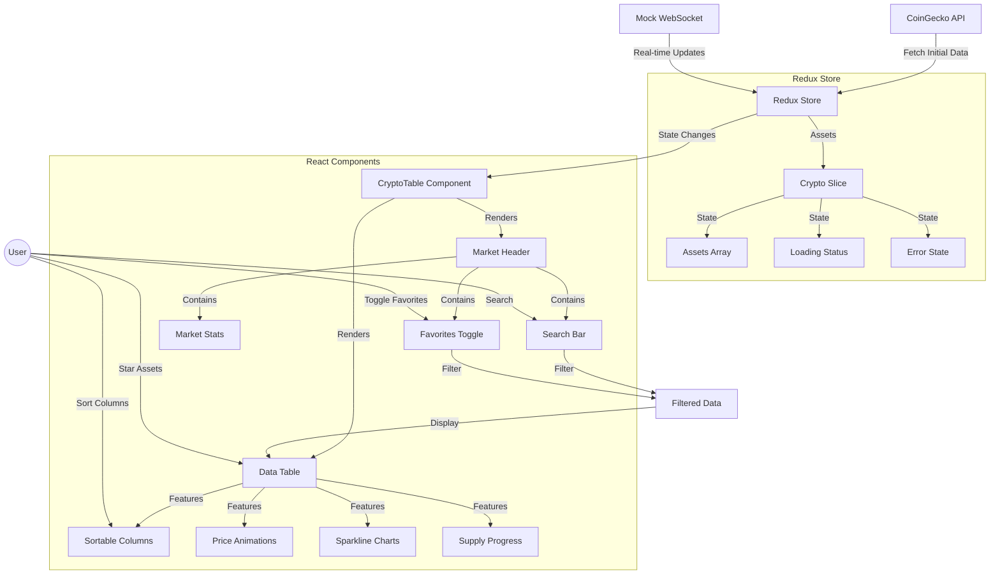
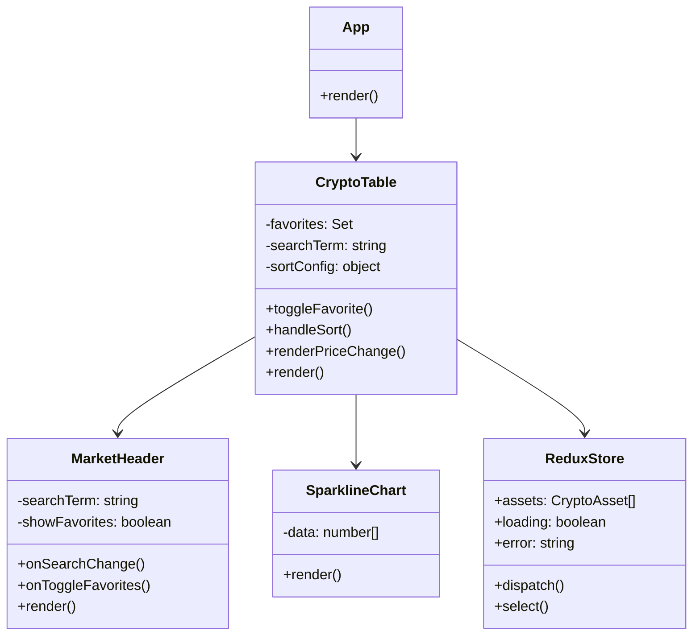
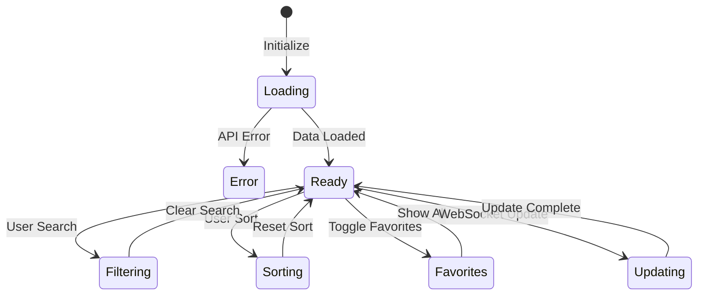

# CryptoDash - Real-Time Cryptocurrency Tracker

A professional React application that displays real-time cryptocurrency data with a beautiful UI and simulated WebSocket updates.

## 🚀 Features

- Real-time price updates (simulated WebSocket)
- Interactive price charts with sparklines
- Smooth animations for price changes
- Color-coded price changes
- Favorite cryptocurrencies
- Fully responsive design
- Search and filtering capabilities
- Sortable columns
- Supply progress visualization
- Market statistics dashboard

## 🛠️ Tech Stack

- React 18
- TypeScript
- Redux Toolkit for state management
- Tailwind CSS for styling
- CoinGecko API for cryptocurrency data

## 🏗️ Project Architecture

### Project Flow



### Component Structure



### State Management Flow



## 🔄 Data Flow Description

1. **Initial Data Load**
   - Application fetches data from CoinGecko API
   - Data is stored in Redux store
   - Components receive initial state

2. **Real-time Updates**
   - Mock WebSocket simulates live price updates
   - Updates are dispatched to Redux store
   - Components re-render with new data

3. **User Interactions**
   - Search filters assets in real-time
   - Favorites can be toggled
   - Columns can be sorted
   - Assets can be starred

4. **Component Updates**
   - Price changes trigger animations
   - Charts update with new data
   - Supply bars show circulation ratio
   - Market stats refresh periodically

## 📁 Project Structure

```
src/
  ├── components/      # React components
  ├── services/       # API and WebSocket services
  ├── store/          # Redux store and slices
  ├── types/          # TypeScript type definitions
  └── App.tsx         # Root component
```

## 🚀 Setup Instructions

1. Clone the repository:
   ```bash
   git clone <repository-url>
   cd crypto-price-tracker
   ```

2. Install dependencies:
   ```bash
   npm install
   ```

3. Start the development server:
   ```bash
   npm run dev
   ```

4. Open your browser and navigate to `http://localhost:5173`

## 🔧 State Management

The application uses Redux Toolkit for state management with the following features:

- Real-time price updates
- Optimized re-renders using selectors
- Persistent favorites using localStorage
- WebSocket simulation for live updates

## 🤝 Contributing

1. Fork the repository
2. Create your feature branch (`git checkout -b feature/amazing-feature`)
3. Commit your changes (`git commit -m 'Add some amazing feature'`)
4. Push to the branch (`git push origin feature/amazing-feature`)
5. Open a Pull Request

## 📝 License

This project is licensed under the MIT License - see the LICENSE file for details.

## 🙏 Acknowledgments

- Data provided by [CoinGecko API](https://www.coingecko.com/api)
- Icons by [Lucide](https://lucide.dev)
- UI components styled with [Tailwind CSS](https://tailwindcss.com)

