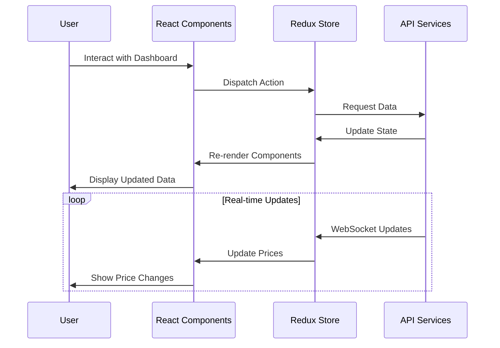
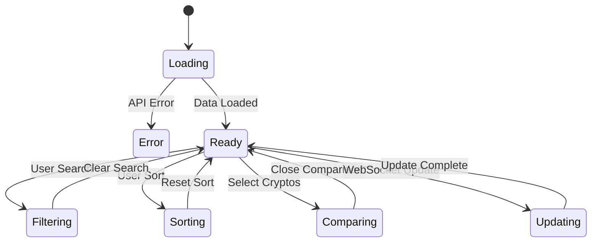

# CryptoDash - Professional Cryptocurrency Dashboard


A modern, real-time cryptocurrency dashboard built with React and Redux Toolkit, featuring a polished UI and comprehensive tracking capabilities.

## Features

- 🚀 Real-time cryptocurrency price tracking
- 📊 Interactive price comparison charts
- 🎨 Modern glassmorphism design
- 🔍 Advanced search and filtering
- ⚡ Responsive data tables
- 📱 Mobile-friendly interface
- 🔄 Multi-cryptocurrency comparison
- 📈 Historical price trends

## Tech Stack

- **Frontend Framework**: React
- **State Management**: Redux Toolkit
- **Routing**: React Router DOM
- **Styling**: Tailwind CSS
- **Charts**: Chart.js with React-Chartjs-2
- **Icons**: Lucide React
- **Real-time Updates**: WebSocket simulation

## Workflow

### Application Architecture

### Component Interaction



### Data Flow



## Pages

1. **Dashboard** (`/`)
   - Real-time cryptocurrency price table
   - Search and filter functionality
   - Market statistics header
   - Sortable columns

2. **Compare** (`/compare`)
   - Multi-cryptocurrency comparison
   - Interactive price charts
   - Custom time range selection
   - Up to 5 cryptocurrencies comparison

## Getting Started

1. Clone the repository:
   ```bash
   git clone https://github.com/yourusername/cryptodash.git
   cd cryptodash
   ```

2. Install dependencies:
   ```bash
   npm install
   ```

3. Start the development server:
   ```bash
   npm start
   ```

4. Open [http://localhost:3000](http://localhost:3000) in your browser.

## Project Structure

```
src/
├── assets/         # Images and static files
├── components/     # React components
├── features/       # Redux slices and features
├── services/       # API and WebSocket services
├── store/         # Redux store configuration
└── App.tsx        # Main application component
```

## Components

- **Navigation**: Modern glassmorphism navbar with route indicators
- **CryptoTable**: Real-time cryptocurrency data display
- **MarketHeader**: Market statistics and metrics
- **CryptoComparison**: Interactive chart comparison tool


## Acknowledgments

- Powered by [ighackerbot](https://github.com/ighackerbot)
- Cryptocurrency data provided by [CoinGecko API](https://www.coingecko.com/en/api)

