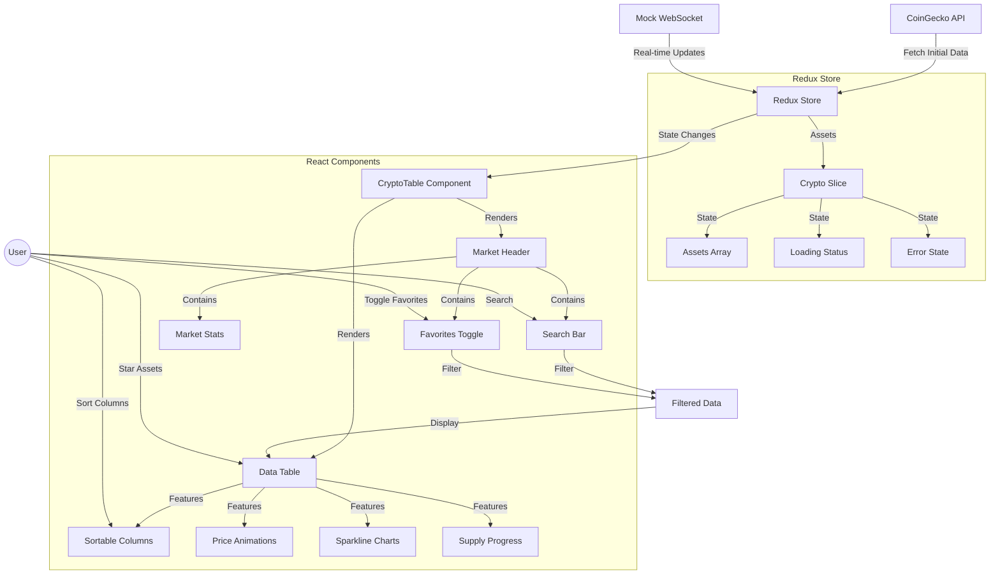
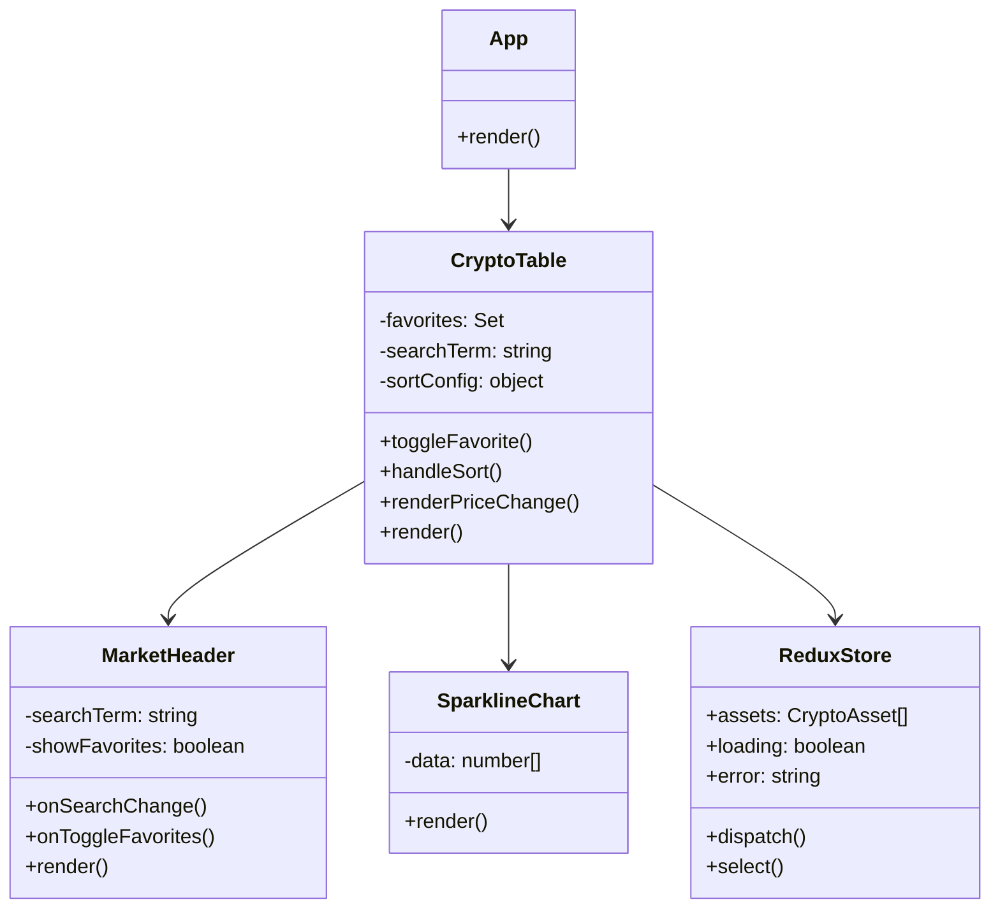
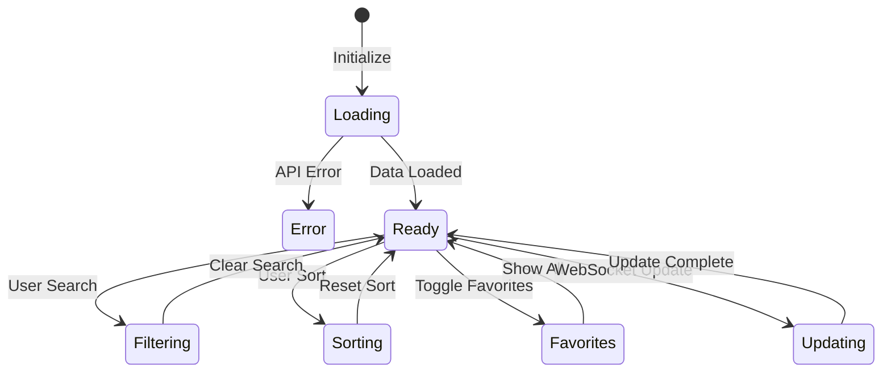

# CryptoDash Architecture

## Project Flow

## Data Flow Description

1. **Initial Data Load**
   - Application fetches data from CoinGecko API
   - Data is stored in Redux store
   - Components receive initial state

2. **Real-time Updates**
   - Mock WebSocket simulates live price updates
   - Updates are dispatched to Redux store
   - Components re-render with new data

3. **User Interactions**
   - Search filters assets in real-time
   - Favorites can be toggled
   - Columns can be sorted
   - Assets can be starred

4. **Component Updates**
   - Price changes trigger animations
   - Charts update with new data
   - Supply bars show circulation ratio
   - Market stats refresh periodically

## Component Structure

## State Management

This architecture documentation shows the main components and data flow of the CryptoDash application. The Mermaid diagrams illustrate:

1. The overall data flow from API to UI
2. Component hierarchy and relationships
3. State management and transitions
4. User interaction flows 